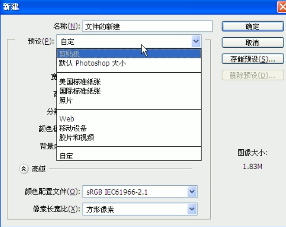
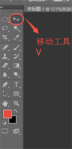
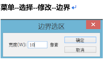
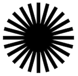
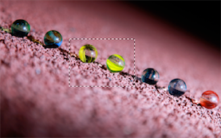
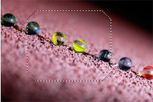
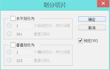
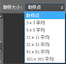
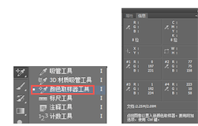

### [ps6破解](https://www.jianshu.com/p/097353202b66)
---

#### 文件新建:ctrl+n 
---


````
若有经常使用的尺寸，可以直接设置好宽度和高度，点击存储预设；
注：ctrl+alt+n  重复上次的文件尺寸大小；
若不需要此尺寸，可以直接选中并点击删除预设；

分辨率:
	若用于网页设计，网页浏览，可选择72分辨率，单位为像素
	若用于高级图像处理，可选择300分辨率，单位为像素
	若用于印刷等出版，可选择300分辨率，单位可以选择毫米或厘米
颜色模式:RGB模式、CMYK模式、位图、灰度、Lab颜色
    RGB模式：RGB模式是PS中最常用的模式，也被称之为真彩色模式，在RGB模式下显示的图像质量较高，也是PS的默认模式；RGB颜色模式主要是由R（红）、G（绿）、B（蓝）三种基本色相加进行配色，并组成了红绿蓝三种颜色通道；该模式适用于显示器、投影仪、扫描仪、数码相机等；
    CMYK模式：CMYK颜色模式是打印全彩图像的颜色系统。青色、品红、黄色、和黑色是平版印刷机和喷墨打印机使用的油墨颜色。CMYK模式主要是由C（青）、M（洋红）、Y（黄）、K（黑）4种颜色相减而配色的。因此它也组成了青、洋红、黄、黑4个通道，每个通道混合而构成了多种色彩。
  当对图像进行印刷时，必须将它的颜色模式转换为CMYK模式。由于在CMYK模式下Photoshop的许多滤镜效果无法使用，所以一般都使用RGB模式，只有在即将进行印刷时才转换成CMYK模式，这时的颜色可能会发生改变。
   位图：位图模式是用黑色和白色来表现图像的，不包含灰度和其他颜色，因此它也被称为黑白图像。
   灰度：灰度模式下的图像只有灰度，而没有其他颜色。如果将彩色图像转换成灰度模式后，所有的颜色将被不同的灰度所代替。
   Lab颜色：Lab模式既不依赖光线,也不依赖于颜料,Lab模式由三个通道组成,它的一个通道是亮度,即L.另外两个是色彩通道,用A和B来表示.A通道包括的颜色是从深绿色（底亮度值）到灰色（中亮度值）再到亮粉红色（高亮度值）；B通道则是从亮蓝色（底亮度值）到灰色（中亮度值）再到黄色（高亮度值）.因此,这种色彩混合后将产生明亮的色彩.


背景内容：
   白色：背景画布为白色单色
   背景色：背景画布的颜色为背景色设置的颜色
   透明：背景内容无颜色填充，呈现透明状态   
````

-----

##### 文件的存储


````
常用的格式：
   PSD格式是Photoshop工具的默认格式，也是唯一支持所有图像模式的文件格式。它可以保存图像中的图层、通道、辅助线和路径等信息。一般寻找素材会选择PSD格式，文件做完或者没做完都习惯性保存PSD源文件，方便后期修改。由于PSD格式所包含的图像数据信息比较多，因此比其他格式的图像文件要大得多。
   JPEG是一种有损压缩的格式，此格式的图像通常用于图像预览和一些超文本的文档中（HTML文档），文件后辍名为“.jpg”或“.jpeg”，最大的特色是文件比较小，可以进行高倍率的压缩，是目前所有格式中压缩率比较高的格式之一，但是JPEG格式在压缩保存的过程中会以失量最小的方式丢掉一些肉眼不易察觉的数据，因而保存的图像与原图有所差别，没有原图的质量好，不适合印刷使用。
   PNG用来存储灰度图像时，灰度图像的深度可多到16位：存储彩色图像时，彩色图像的深度可多到48位，并且还可存储多到16位的通道数据。PNG在网页应用中使用较为广泛,比如在Dreamweaver中插入一张透明背景图片，就可以使用PNG格式的图片。PNG能保留完整的照片色彩，是一种非失真性压缩格式。不过唯一的缺点是文件较大，不利于网页浏览。由于PNG格式不完全支持所有浏览器，所以在网页使用要比GIF和JPEG格式使用少的多。
   GIF格式是一种图形格式，只是保存最多256色的RGB色阶数，是一种基于LZW算法的连续色调的无损压缩格式。目前几乎所有相关软件都支持它。GIF格式的另一个特点是其在一个GIF文件中可以存多幅彩色图像，如果把存于一个文件中的多幅图像数据逐幅读出并显示到屏幕上，就可构成一种最简单的动画。GIF分为静态GIF和动画GIF两种，扩展名为.gif，是一种压缩位图格式，支持透明背景图像，适用于多种操作系统，“体型”很小，网上很多小动画都是GIF格式。其实GIF是将多幅图像保存为一个图像文件，从而形成动画，所以归根到底GIF仍然是图片文件格式。
   BMP格式：它是Window操作系统中的标准图像文件格式，其不支持CMYK模式的图像。由于BMP文件格式是Windows环境中交换与图有关的数据的一种标准，因此在Windows环境中运行的图形图像软件都支持BMP图像格式。
   TIFF格式：TIFF是一种无损压缩格式，是一种非常广泛的图像格式，TIFF与JPEG和PNG一起成为流行的高位彩色图像格式。TIFF格式可以制作质量非常高的图像，因而经常用于出版印刷。如果您要在一个并非创建该图像的程序中编辑图像，则以这种格式保存将很有帮助，因为多种程序都可以识别它。TIFF用于在应用程序和计算机平台之间交换文件，是一种灵活的位图图像格式，几乎受所有的绘画、图像编辑和页面版画应用程序的支持。而且，几乎所有的桌面扫描仪都可以生成TIFF图像。

总结：psd存储了所有图像模式；
     jpeg有损压缩、文件较小；
     png非失真压缩、文件较大；
     gif:无损压缩；

````

----

#### 文件的打开与关闭
----
##### 文件的打开：
* ctrl+o
* 双击ps画面区域打开
* 直接拉拖动文件到ps当中去
* 直接双击打开psd文件

##### 文件的关闭：


----

#### 移动工具
----

 

* 移动工具不仅可以轻松的选择每一个图层，还可以移动各个图层到自己的理想位置，还可以进行文件图像与其他文件之间的移动；
* 移动工具快捷键：V
* 移动工具属性：


1. 自动选择：在默认情况下，移动工具的“自动选择”一项是没有勾选的。表示只能选中图层窗口中选定的固定图层，不能随意的点击选择别的图层。在这里，我们也勾选“自动选择”，可任意选择图层
2. 显示变换控件  ctrl+T 
3. 对齐方式(至少两个或者两个以上的图层); 分布（至少三个或者三个以上的图层）
  分组快捷键：CTRL+g (有时候需要将多个图层水平距离一定，我们可以垂直分组，然后选择所有组，再使用对齐)
  
````
  图层复制：ctrl+alt（option）+ 鼠标拖动
````

----

#### 选区工具组
----

* 快捷键：M  
* 在PS中可以通过创建选区对图像进行填充、移动、复制、变换等编辑操作。在PS操作中，用选区选取范围是比较常用的方法。建立选区以后，就可以对选区内的图像进行操作。

#### 选区的运算
1. 利用选择工具建立选区，然后利用属性面板中的运算按钮。
1. 利用快捷键，如下：

* Shift:添加选区(合并选区) 
* Alt:减去选区（删减选区）  
* shift+alt:与选区相交 

#### 羽化
* 快捷键：shift+F6
* 选区的羽化是PS中使用频率比较高的一项功能，它可以起到融合边缘的效果，实现渐变过渡边缘。

#### 消除锯齿
* 消除图像边缘部分的锯齿状，使边缘看起来比较平滑

````
  要为选区填充颜色：新建选区-》新建图层-》填充颜色；
````
#### 样式--宽度--高度
* 可以自由绘制选区，也可以固定比例，固定大小，与宽度及高度结合使用；

----

#### 调整边缘
----

----

#### 图层
----
* 图层：学习PS的人员都知道PS作图是离不开图层的操作的；在图层里面，可以加入文本、图片等，也可以自由的修改、创新，良好的分层更是有助于设计更完美的展示及修改；
* 新建图层：可以直接点击如图所示图标，也可以使用快捷键：Ctrl+Shift+Alt+N; 

* 填充前景色:Alt+Del  填充背景色：Ctrl+Del
* 图层快捷键：Ｆ７

##### 删除图层：
1. 将图层直接拖动至删除箱
2. 右击删除图层
3. Del健直接删除

##### 复制图层：右击复制图层或者使用快捷键Ctrl+J;
##### 图层重命名：双击图层名字区域 
##### 合并图层：Ctrl+E
##### 合并可见图层:Ctrl+Shift+E
##### 建组：Ctrl+G

----

#### 矩形选择工具
----


* 快捷键：M/Shift+M

````
   填充前景色：Alt+Delete  必须要在图层上面
	填充背景色：Ctrl+Delete  必须要在图层上面
	取消选区：Ctrl+D
	shift 可以约束等比 （拖拽边角点）,可以画等比例的宽高（正方开）；先选择区，再按shift
	alt   约束中心点
	撤销操作：
	ctrl + Z  最后两部互相切换
	ctrl + alt + Z 一直往回撤销
	ctrl + shift + Z 重做变换选区:Alt+S+T
	复制图层：
	按着ALt+鼠标拖动

````

----

#### 椭圆选框工具

----

 

* 快捷键：M/Shift+M

````
调节图层顺序：
ctrl + [ 向下走一层  ] 向上走一层
ctrl + shift + [  or  ]   (直接一步到位到最底层或最顶层)
自由调节外框：ctrl + T  大小   或者 shift+鼠标拖动   
变化选区：Alt+S+T
shift 可以约束等比 （拖拽边角点）
alt   约束中心点
放大与缩小画面：
可按Alt+鼠标滚轮
放大：Ctrl+“+”
缩小：Ctrl+“-”
移动中心点：Alt健进行中心点的拖动，可利用shift健协助；

打开或隐藏标尺：Ctrl + R 
````
* 利用标尺确定画布的中心点; 视图->新建参考线->50% 

----

#### 单行选框工具

----
* 
 
````
复制：Ctrl+J
     Ctrl+C
粘贴：Ctrl+V
剪切：Ctrl+X－－－自动生成一个新的图层	

````

----

#### 单列选框工具

----
*  如图所示，打开PS，在选区工具组里，第四个就是单列选框工具，其呈现出来的状态是垂直且单位为1像素的线，单击即可生成，若图片过大，需要进行放大仔细观看。

````
键盘上下左右方向键可以移动图层/选区；
变换并复制:Ctrl+Alt+T  （先要选中）
重复变换：Ctrl+Alt+Shift+T
shift+点击：加选
alt+点击：减选

````

----
#### 修改选区边界
----

* 边界：用于创建将原选区边界分别向内外扩展指定宽度后生成的区域,在原有的选区上多出一个选区，填充颜色时填充两个选区中间的部分，并且呈现出羽化状态；


````
注意:
1,边界宽度值：1-200像素之间；
2,必须是在已经有选区存在的情况下，进行修改边界。如果没有选区存在，那么修改边界命令呈灰色状不能够使用。
3,与描边的区别，使用边界命令就自动羽化了，而描边命令则不会出现羽化效果。
4,如果宽度值设置为奇数，则选区的边界由蚁行线内侧选择度大于50%的像素定义。
5、如果宽度值设置为偶数，则选区的边界由蚁行线内外两侧的像素共同定义。

````
* 未设置边界效果前：
* 修改边界后：

----
#### 选区平滑效果(可以实现圆角效果)
----
* 平滑：调节选区的平滑度，边角圆滑效果,平滑选区中的尖角和锯齿；
* 菜单--选择--修改--平滑
* 默认前景色背景色快捷键：D
* 反选：Ctrl+Shift+I
* 平滑前效果：
* 平滑后效果：

----
#### 选区的扩展
----
* 扩展：原选区沿边界向外扩大指定的宽度；
* 菜单--选择--修改--扩展
* 扩展前效果：
* 扩展后效果：
* 注意：扩展会把你的选区微变化

#### 选区的收缩
* 收缩：原选区沿边界向内缩小指定的宽度；
* 菜单--选择--修改--收缩
* 收缩前的效果：
* 收缩后的效果：
* 注意：收费也会把你的选区微变化
#### 选区的羽化（可以实现类似投影、阴影效果）
* 羽化：羽化将会使选区边缘变得柔和，有自然的过渡衔接，羽化像素的尺寸将会决定选区边缘逐渐软化的区域大小。
* 快捷键：Shift+F6
* 菜单--选择--修改--羽化
* 羽化前的效果：
* 羽化后的效果：
* 把背景层变为普通图层：按着ALt双击图层缩略图 
* 后退：Ctrl+Z
* 连续撤销：Ctrl+Shift+Z
* 根据视觉习惯进行绘图：从上到下  从左到右
* 上下左右两边同时放大或者缩小：按Alt

----
#### 套索工具组
----
 

* 快捷键： L   可按shift+L进行切换
* 套索工具：主要是用来进行不规则形状的选取，利用鼠标拖拽制作选取范围；
	* 方法：鼠标左键点击不松手拖动，释放左键之后终点与起点将自动链接起来，且自动创建选区；
* 多边形套索工具：用于绘制直线型的选取范围；
	* 方法：单击鼠标左键确定起点，可松开鼠标，再选择下一处节点的位置，节点与节点之间将自动连接成选区线段，当终点与起点重合时，鼠标右下角将会出现圆圈，单击即可闭合生成选区，如果在绘制的过程中封闭选区，双击即可形成闭合选区；

````
技巧：
	1,按Shift键可以创建水平、垂直、45°角的线；
	2,如果在创建选区的过程中出错，可以按键盘上的delete即可删除刚创建的节点，也可以按esc键退出重新创建选区；
	3,套索工具和多边形套索工具可相互结合使用，在套索工具下按着Alt键不松开即可切换到多边形套索工具；

````
* 磁性套索工具：是一种比较智能的选择工具，可以自动吸附图像的边缘，沿着图像边缘产生选区，适合于抠图，但是需要选择边缘清晰、对比度明显的图像；
	* 方法：单击左键定义起点，松开鼠标，沿着图像边缘移动鼠标位置，当终点与起点重合时，鼠标右下角将会出现圆圈，单击即可闭合生成选区，如果在绘制的过程中封闭选区，双击即可形成闭合选区；

````
技巧：
	1，在绘制的过程中，若图像某处边缘不清晰，可单击鼠标人为确定下一个节点；
   2，如果在创建选区的过程中出错，可以按键盘上的delete即可删除刚创建的节点，也可以按esc键退出重新创建选区；
   3，磁性套索工具和多边形套索工具可相互结合使用，在磁性套索工具下按着Alt键不松开并单击即可切换到多边形套索工具，松开之后即可变回磁性套索工具；

````
##### 磁性套索工具属性栏:
* 宽度：检测的范围宽度，默认为10像素，若想更直观的看到检测宽度，可以按键盘上的的Caps lock切换到精确光标的方式，光标就会变成一个圆圈，就可以直观的看到宽度范围了，宽度的数值越小得到的选区越精确，可根据实际情况适当调节宽度值；
* 对比度：控制周围色与边缘色彩的反差程度，对比度数值设置1-100；若选取的图像与周围图像间的颜色对比度比较强，可设置一个较高的百分数值，反之，设置数值较低比较好；
* 频率：控制绘制过程中生成的节点数量，数值越大，速率越快，节点越多，最大值为100，默认值为57，当图片边缘比较复杂的时候，可以采用较大的频率值，来提高边缘的准确性；
* 钢笔压力： 用光笔绘图板的用户才会用到。

----
#### 快速选择与魔棒工具
----

* 
* 快捷键： W  
* 方法：选择快速选择工具，调节画笔大小，可按“{”“}”进行画笔大小的快速调节，点击并拖动鼠标选择需要选取的范围，选区会自动延伸；
* 快速选择工具属性栏 
* 选择方式：
	* 新建：加选： 减选： 
	* 注意：当没有选区时，默认的选择方式时新建，当选区建立后，自动改为添加到选区，按ALt键，可以将选择方式变为从选区中减去。
* 画笔调整：包括大小、硬度、间距，对于选区边与背景颜色反差比较多的图像，可适当将画笔笔触调大，进行快速的选择，提高效率，反之调小，进行细致的范围选取；
1. 大小：鼠标拖动三角往右将画笔放大，往左将画笔缩小；注意：右括号“】”可增大画笔的大小，左括号“【”可减小画笔的大小，在调节时，请将自己的输入法关闭；
2. 硬度：当笔头设置的硬度值越大，选区边缘就会越生硬，数值越小，变会越柔和，但是对快速选择工具的意义不大；
3. 间距：若设置的数值比较小，选区一般是连续的，若设置的数值比较大，一般是间断的，通常情况下不做特殊调整；
4. 角度：与圆度可以配合使用，如下图，当角度设置为50°时，画笔笔触将不再是水平或者垂直展现出来；
5. 圆度：可将画笔笔触变为椭圆形，但是对于快速选择工具，角度和圆度用的几率都不是很大；
6. 需要外接手绘板才可以完成制作；

##### 对所有图层取样：
* 基于所有图层创建一个选区，而不仅仅针对当前图层。
##### 自动增强
* 减少选区边界的粗糙程度，使选区向主体的边缘进一步流动，遇到选择对象的边沿有模糊的过渡色时，会做一个自动边缘调整，扩大要选择的范围；
##### 调整边缘

-----
##### 魔棒工具
----

* 快捷键： W  
* 魔棒工具:可以通过简单的操作创建选区，且选区范围是与鼠标落点处颜色相邻或相近的区域，对背景简单且颜色比较单一的图像可进行快速的选取；
* 方法：选择魔棒工具，通过鼠标单击图像颜色区域取样，可按Shift键加选，Alt键减选；

````
技巧：
   1、在选择图像时，要适时放大进行选择或加选，以免有漏选的现象发生，全部选择之后，请检查看选取的完整性；
   2、魔棒工具一般抠取背景色与主体色差比较大的图片，若背景比较复杂或与主体色差比较小或有融合的部分，可采取别的方式抠图；

````

* 魔棒工具属性栏
* 取样大小：默认为取样点，是取样点像素的大小。比如3×3，就是三个像素乘三个像素的大小；
* 容差：魔棒工具是利用色彩的容差来选择图像的范围，所以容差值设置对于魔棒工具起着非常重要的作用；容差越大，选取颜色时的色差范围越大，反之越小，取值范围：0-255，当容差值设置为0时，选区选取只能和取样颜色完全相同的颜色区域。
* 连续：选择位置相连且颜色相接近的区域，若处于勾选状态，魔棒只选择相邻区域，与图像中其他色块无关，该选择处于非勾选状态，则选择图像中所有颜色相接近的区域；
* 对所有图层取样：处于未勾选状态时，魔棒工具只从当前图层选取颜色范围，若勾选，在选取时会将文件中所有可见图层的相似颜色全部选取，如下图；


-----
##### 裁剪工具
----
 

* 快捷键： C  
* 裁剪工具:在PS作图的过程当中，往往会遇到图片大小不合适或者画布大小需要修改等问题，有时候拍摄出来的照片也需要调整其构图及大小，那我们就可以用裁剪工具移去部分图像也可以扩大画布范围，裁剪工具也可以修正歪斜的图片，大小及长宽比可手动任意拖动。
* 方法：选中PS裁剪工具，在图像中拖动选取范围，即可在图片的四角和四边会出现裁剪标识---8个控制点，并显示裁剪范围，且其他区域会变暗，选框可以在创建之后调整，利用控制点对框内范围进行放大、缩小、旋转等操作，调整完成之后双击鼠标或按回车（enter）键确定选取范围；若要取消裁剪，可以鼠标右击“取消”，也可以按快捷键Esc进行删除；

````
技巧：
   1，将鼠标放置在框内可移动选框；
   2，3:2、4:3、1:1是处理摄影图片常用选项；
````

-----
##### 透视裁剪工具
----
 
 
 * 透视裁剪工具:可以将裁剪区域调整为透视或者任意四边形，从而改变图像形态，也可以纠正不正确的透视变形，对倾斜的图片进行矫正。
 * 方法：
	* 选择透视裁剪工具，在图像当中任意拖动矩形，可以利用边缘框点进行边框的变形更改；
	* 选择透视裁剪工具，直接单击鼠标定出四个点画出任意四边形
	* 可以按Alt键更改画面中心点
	* 注意：任何变形都会导致画面的扭曲，所以变形的程度不能太大。
* 透视裁剪工具属性栏 
* 设置裁剪图像的宽度、高度及分辨率 ,在框中可以输入需要的尺寸大小
* 前面的图像：单击可以记录图像的大小及像素，可以使裁剪后的图像与之前记录的图像大小相同；
* 清除：单击可以清除设定好的宽高值及分辨率值；
* 显示网格：勾选状态是显示裁剪框的网格，不勾选则只显示外框；
* 选完以后，按enter键就可以确定最终图片；

-----
##### 切片工具
----

*   
* 快捷键： C  
* 切片工具:切片工具就是用来切割图像，学习切片工具有两方面原因：
	1. 	主要用于网页设计，改善网页加载速度，让相同的网速下网页加载速度更快，给用户良好的网页浏览体验。
	2. 设计出来的Jpg图片没有办法做链接跳转，需要切片处理添加超链接做跳转。
* 方法：选择 工具箱中的“切片工具”，在想切入的地方点击并拉动鼠标，会出现四方形的切片区域，拉到合适的位置，松开鼠标后可完成创建一个用户切片，且有蓝色数字标识,用户以外生成自动切片。同样的操作，可以继续操作下面的切片用户，操作错误，可以右击或者delete键删除切片或用切片选择工具进行修改编辑。

````
技巧：
   1,当鼠标放置在当前切片用户范围处，可直接切换切片选择工具，当鼠标移动至其他切片处，可按Ctrl键切换选择工具；
   2,隐藏切片：Ctrl+H   清除切片：Alt+V+C；如果不想同时隐藏辅助线，可以按完ctrl+H后再任意拉一条辅助线即可;
   3、按Shift可以加选切片并进行组合切片；

````
* 切片工具属性栏 
* 样式：可以改变切片工具的裁切标准：
	* 正常：随意切片，切片大小和位置取决于自己画的框；
	* 固定长宽比：根据特定的长宽比设置切片框；
	* 固定大小：固定设置切片的长宽大小；
* 宽度：设置切片的宽度；
* 高度：设置切片的高度；
* 基于参考线的切片：如果我们的文件需要参考线标注可以更加准确，我们可以执行基于参考线的切片操作，使切片精准度更高；

-----
##### 切片选择工具
----
* 
* 快捷键： C 
* 切片选择工具:当我们把图片切出来之后，可以用切片选择工具删除无用的切片，也可以变化切片的大小和位置等，也可以进行切片的排列对齐，图片的超链接等;
* 方法：
	1. 点击切片，可以根据切片边或者角点随意拉伸或收缩切片，改变大小及位置，也可选中直接按delete或右击进行删除切片；
	1. 在切片位置处右击选择编辑切片选项，或双击切片，可以调出编辑框，进行网址链接等相关信息的设置；
* 切片类型：

````
	无图像；该切片输出空白无图像可以在切片中输入HTML文本；
	图像：该切片图像输出成图像；
	表：切片导出时作为嵌套表写入到HTML文本文件中；
	名称：输入切片的名称，但是如果选择无图像，则没有名称选项；
	URL：为切片设置一个超链接地址，在浏览器单击该切片图像会跳转到相对应的网址里；
	目标：指定窗口打开位置，是原窗口打开，还是在新窗口（blank）打开链接；
	信息文本：鼠标移到这个块时浏览器左下角显示的内容；
	Alt标记：图片的属性标记，鼠标移动到这块时鼠标旁的文本信息；
	尺寸定位：定位切片的坐标和长宽；
	切片背景类型：可自选背景色填充透明区域。

````
* 存储：存储方式选择“存储为Web所用格式”

````
1、保存格式选择HTML和图像，如果选择仅限图像，只输出图像。如果选择HTML，不会显示图片，设置为默认设置，切片为所有切片；
2、CMYK模式的图片在网页上是看不到的；
3、文件名改成英文，防止有电脑识别不出来。
````

* 切片工具属性栏   
* 置为顶层：把所选薄片调到最前
*  前移一层：把所选薄片向前移动一个水平层
*  后移一层：把所选薄片向后移动一个水平层
*  置为底层： 把所选薄片调到最后
*  提升：可以将自动生成的切片提升为手动切片，对切片进行设置
*  划分：可以根据设定将切片水平垂直的继续划分成多个小切片，可以指定切片的个数或像素大小 
*   对齐：切片过多可能会造成重叠，因此我们可以用对齐功能调整切片的次序
*  分布：可以让多个切片按照一定的分布规律进行排列（与选区类似），多选切片可以按Shift键
*  隐藏自动切片：可以将自动切片进行隐藏 
*   设置切片选项： 也是进行切片选项的一种方法

-----
##### 吸管工具
----
* 
* 快捷键：I
* 吸管工具可以很好的帮助作图人员进行图像中颜色的吸取，以拾取点周围的平均色进行颜色取样且一次只能吸取一种颜色。
* 方法:点击吸管工具在想要吸取颜色的地方点击，前景色会变为所取颜色，然后就可以进行颜色填充，也可以通过颜色面板观察前景色背景色的变化及色值，吸取颜色作为当前的前景色。
* 技巧：

````
	1、按Alt键用吸管工具吸取颜色可定义为当前背景色；
	2、若希望填充颜色和图像上的某处颜色值一样，可直接选吸管工具点击某处进行取色，这样填充的颜色就和所取颜色相同；
	3、吸管工具也可以进行拷贝颜色的十六进制代码，可结合网页设计相关知识使用；
	如“fff6f0” “ color="#4d1980"f ”等
````
* 吸管工具属性栏  
* 取样大小：以鼠标吸取点为中心，进行颜色运算，取样大小设置为取样点，则是准确根据鼠标定点为基准颜色，取样大小设置为3×3平均，则是吸取此点周围三个像素的平均色。
* 样本：吸取颜色的图层范围，有五个选项，选择比较多的是所有图层或当前图层；
* 注：“所有无调整图层”，是指排除掉所有调整层之后，最终叠加效果图里取样点的颜色。

-----
##### 3D材质吸管工具
----
* 
* 快捷键：I
* 3D材质吸管工具需要结合3D图像进行使用，主要可以用来查看当前3D图像所用的材质类型，也可以进行材质类型的改变；
* 方法:选择3D材质吸管工具，单击鼠标左键选取你需要的图像区域，即可在属性栏出现材质类型，也可以在属性窗口里面更换材质；
* 3D材质吸管工具属性栏   
	* 材料油漆桶：用于材质的储存更换等
	* 载入所选材质：可以将当前所选材质存入到材料油漆桶中

-----
##### 颜色取样器工具
----
* 
* 快捷键：I
* 颜色取样器工具:可以对图像信息进行取样，帮助记录数值，可以用数值判断图片是否有颜色方面的问题，方便对比。颜色值会显示在信息面板上并自动编号，同样可以根据取样点的定义其色彩模式。
* 方法:选择颜色取样器工具在图像上所取位置单击，即可建立一个取样点，取样信息会在信息面板中保存并显示出来，图像中最多放置4个取样点，取样点位置可以按Ctrl键进行拖动，改变其位置，对于取样点可进行右击删除或者按住Alt键当鼠标变成剪刀形状点击删除或直接将其拖出画布。
* 颜色取样器工具属性栏 
	* 清除：点击可以清除图像上所有的取样点


-----
##### 标尺工具
----
* 
* 快捷键：I
* 标尺工具:使用标尺工具可以精准的测量图像当中点或线之前的信息，也可以进行图像的修正；
* 方法:选择标尺工具在图像上单击确定一个起点，拖动出一条直线，在松开鼠标的位置确定终点，此时属性栏中会自动显示出坐标轴、宽度、高度、长度、角度等信息；双击起点可以拉出第二条标尺线，当我们的图像不是很正，可以沿着倾斜边画出一条直线，点击“拉直图层”，即可让倾斜的线变水平，同时图像角度会发生一定改变。
* 技巧：

````
1，若想修改拉出的标尺位置或长度方向，可以将鼠标放置在拉出的直线顶点或直线上进行调整；
2，按键盘上的Shift键拉动，可出现水平、垂直或45°线段；
````
* 标尺工具属性栏 

````
	X：使用标尺工具拉出直线起点的X坐标轴数值；
	Y：使用标尺工具拉出直线起点的Y坐标轴数值；
	W：起点与终点拉出直线的宽度；
	H：起点与终点拉出直线的高度；
	A：使用标尺工具拉出的直线与水平线之间的角度；
	L1：标尺工具拉出的直线的长度；
	L2：标尺工具拉出的第二条直线的长度；
	
	使用测量比例：使用测量比例计算标尺数据，在图像中设置与比例单位数相等的指定像素数，创建之后可以记录结果；
	拉直图层：可用于修正歪图，让拉出的直线与水平线平行；
	清除：可清除标尺工具拉出的直线；

````  

-----
##### 注释工具
----
* 
* 快捷键：I
* 注释工具:在图像中添加文字注释及作者信息等内容，用于解释说明图像当中标注的位置信息，使其他人可以直观明了的看到注释信息，便于相关工作人员的修改。
* 方法:打开图像，选择注释工具，通过鼠标左键单击目标位置使其出现注释文本标志，即可在注释中添加文字加以说明，注释标志颜色可以根据属性栏设置修改，在作者栏中可以输入作者的名字，右击可进行删除注释。
注意：在保存的时候，保存PSD格式的文件，若保存JPG或者色彩文件，不会被保存；
* 注释工具属性栏

````
作者:用于输入用户或作者的名字
颜色：设置注释标志颜色
清除全部：清除图像当中的所有注释
显示或隐藏注释面板

````

-----
##### 计数工具
----
* 
* 123计数工具:可以统计图像中目标的个数，是一款数字计数工具，以数字标志的形式显示在画面当中，数目显示在属性栏的“计数”当中，用这款工具可以统计画面中一些重复使用的元素，是款不错的统计及标示工具。
* 方法:选择123计数工具，在目标位置左键单击，旁边即可出现一个数字，再下一个目标位置单击数字会自动按阿拉伯数字递增，并在上方属性栏中显示计数总数，若想改动数字点位置，可把鼠标放在数字的位置处出现三角光标提示，即可移动数字点。
* 技巧：

````
1，按Shift键移动数字点可进行水平/垂直方向的移动；
2，按Alt键左键单击数字点可删除数字段点；
3，保存计数文件保存为PSD格式；
4、键盘上下箭头可以调节标记与标签大小；

````
* 计数工具属性栏 

````
	计数：显示计数总数；
	计数组：可以创建新的可见计数组，在计数组名称框内可以显示；
	关闭小眼睛图标可暂时隐藏数字点，删除当前所选计数组图标可删除计数组（至少有两组可以进行删除操作）； 
	清除：可以清除图像当中的所有计数点；
	拾色器：可以设置标签颜色；
	标记大小：设置标记的大小；
	标签大小 ： 设置标签的大小；

````

-----
##### 修复画笔工具组
----
* 
* 快捷键：J
* 切换方式其他方法：Shift+J/按Alt键点击修复画笔工具组
* 修复画笔工具组里的功能在PS图像处理方面发挥很大的作用，通过把图像像素的纹理、光照、阴影等与周围像素匹配，使其更好的融合在画面当中，可以很好的美化照片人物图像等，包括污点修复画笔工具、修复画笔工具、修补工具、内容感知移动工具、红眼工具；
##### 污点修复画笔工具
* 主要用于快速修复比较小的污点和瑕疵等，操作起来简单快捷，在有瑕疵的地方单击或划动即可修复；

##### 修复画笔工具
* 用于修复图像当中的缺陷，并能使修复的结果自然的与周围像素融合在一起，需要按下Alt键从图像中取样，定义一个与修复处相近的基准点，再进行修复操作；

##### 修补工具
* 先勾勒出一个需要修补的选区，会出现一个选区虚线框，移动鼠标时这个虚线框会跟着移动到适当的位置，比如与修补区相近的区域，单击即可。
#### 内容感知移动工具
* 用来移动图片中主体，可以随意放置到合适的位置。移动后的空隙位置会被智能修复。
##### 红眼工具
* 去掉照片中由于反光产生的红眼现象

* 方法：根据作图情况，选择修复画笔工具组相应的工具，结合工具属性栏相关设置进行调节不同的参数，达到不同的修复效果。
* 技巧：通常采用修图工具会影响到本来的图像效果，建议在作图前可以先复制一层进行复件的操作；


-----
##### 污点修复画笔工具
----
* 
* 快捷键：J
* 污点修复画笔工具：主要用于快速修复比较小的污点和瑕疵等，操作起来简单快捷，在有瑕疵的地方单击或划动即可修复，且PS会自动将修复区域与周围像素自然的融入到一起，不会留下特别明显的人为修复的感觉。
* 方法：选择污点修复画笔工具，调整画笔的大小及其他相关设置，在所要修复的区域单击或轻微划动即可迅速的去除小污点或瑕疵部分；
* 技巧

````
1，此工具不适合在较大面积中使用，在修复时细心的处理瑕疵部位，避免大片范围的一次性修复；
2，适当调节画笔大小，画笔越大，画面修复速率越快但是效果会越粗糙；
3、调节笔头大小可以通过键盘上的的左右中括号键【 】进行操作；

````

* 污点修复画笔工具属性栏：

````
画笔选取器：用于调整画笔的大小、硬度、间距、角度等（详解见第25节快速选择工具）；
模式：
	可以设置修复图像与源图像之间的混合方式
	替换：可以保留画笔描边边缘处的杂色、胶片颗粒和纹理。
	其他模式在讲图层混合模式时进行讲解；
类型:
	包括“近似匹配”、“创建纹理”、“内容识别”三项，
	近似匹配：在修复图像时，以画笔定位点为基准，根据周围像素内容来修复；
	创建纹理：以画笔定位点为基准创建一些相似的纹理，进行填充修复的区域；
	内容识别：软件默认类型，在修复图像时，根据修复区域的像素内容识别，并自动填充；
对所有图层取样：
	若选择该项，修复操作是从所有可见图层中进行，若不选择，则从当前图层中进行操作；


````

-----
##### 修复画笔工具
----
* 
* 快捷键：J
* 修复画笔工具:用于修复图像中的杂斑、污点等，且图像修复处将智能的与周围像素相互融合在一起，使修复后的图像看起来比较自然美观。
* 方法:选择修复画笔工具，按着Alt键配合鼠标点击从图像中取样，在需要修复的区域进行点击或者涂抹操作即可。
* 修复画笔工具属性栏:

````
	画笔选取器：调整画笔的大小样式硬度等；
	仿制源：在仿制源面板中，可以设置5个不同的仿制源，为修复比较复杂的图片；
	模式：图像的混合模式，替换--源点处图像替换修复处图像，视觉效果基本一致。
	源：选择取样，需要按Alt键在当前的图像中单击取样作为取样点修复图像；选择图案，可选择图案直接修复图像；
	对齐：未选择对齐，取样点始终不变，即使在操作过程中松开鼠标后再次修复依然会使用初始取样点修复图像；选择对齐会对图像像素连续取样，取样点位置会跟随光标的移动发生相应的变化，不会重复复制；
	样本：用于设置从指定的图层中进行数据取样。包括当前图层、当前和下方图层、所有图层;
	打开以在修复时忽略调整图层：用于忽略调整的图层，可在实际运用中尝试调整出的视觉效果;

````

-----
##### 修复工具
----
* 快捷键：J
* 方法	:修补工具在使用的过程中会创造选区，固定出一定的区域，选区可以进行加、减、交叉的运算，也可以进行填充颜色或羽化操作使修复边缘更加平滑；首先用鼠标绘制出需要修复部位的选区，之后在选区内单击拖动鼠标移动选区至目标区域，松开鼠标即可看到修复后的效果，
* 修补工具属性栏 

````
	选区运算：新建、加、减、相交
	修补：
	正常：修复区域与目标区域混合融合在一起；
	内容识别：修复区域与周围内容混合融合在一起；
	
	源：选区内的像素会随着鼠标移动的目标位置的像素产生更改；
	目标：目标位置的图像将被更改为取样选区内的像素内容；
	透明：选区中的图像与目标位置图像产生透明叠加的效果，若不选择，被修补的区域与周围图像只在边缘上融合，内部图像纹理不变；
	使用图案：建立选区后，使用图案便可使用，否则默认灰色不可用，选定一种图像当中；

````


  


 
	


 

