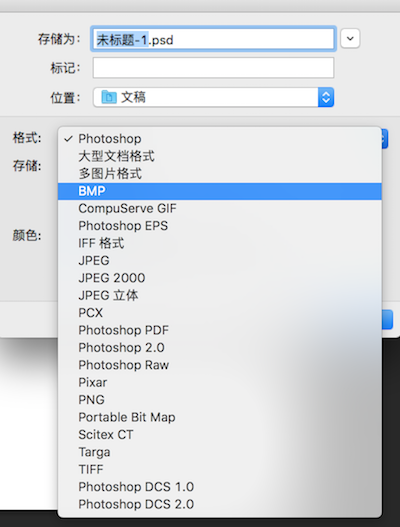
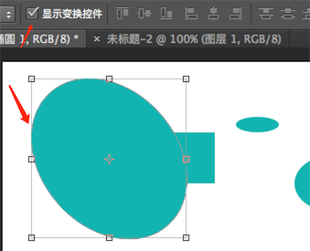
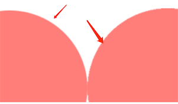

### [ps6破解](https://www.jianshu.com/p/097353202b66)
---

#### 文件新建:ctrl+n 
---


````
若有经常使用的尺寸，可以直接设置好宽度和高度，点击存储预设；
注：ctrl+alt+n  重复上次的文件尺寸大小；
若不需要此尺寸，可以直接选中并点击删除预设；

分辨率:
	若用于网页设计，网页浏览，可选择72分辨率，单位为像素
	若用于高级图像处理，可选择300分辨率，单位为像素
	若用于印刷等出版，可选择300分辨率，单位可以选择毫米或厘米
颜色模式:RGB模式、CMYK模式、位图、灰度、Lab颜色
    RGB模式：RGB模式是PS中最常用的模式，也被称之为真彩色模式，在RGB模式下显示的图像质量较高，也是PS的默认模式；RGB颜色模式主要是由R（红）、G（绿）、B（蓝）三种基本色相加进行配色，并组成了红绿蓝三种颜色通道；该模式适用于显示器、投影仪、扫描仪、数码相机等；
    CMYK模式：CMYK颜色模式是打印全彩图像的颜色系统。青色、品红、黄色、和黑色是平版印刷机和喷墨打印机使用的油墨颜色。CMYK模式主要是由C（青）、M（洋红）、Y（黄）、K（黑）4种颜色相减而配色的。因此它也组成了青、洋红、黄、黑4个通道，每个通道混合而构成了多种色彩。
  当对图像进行印刷时，必须将它的颜色模式转换为CMYK模式。由于在CMYK模式下Photoshop的许多滤镜效果无法使用，所以一般都使用RGB模式，只有在即将进行印刷时才转换成CMYK模式，这时的颜色可能会发生改变。
   位图：位图模式是用黑色和白色来表现图像的，不包含灰度和其他颜色，因此它也被称为黑白图像。
   灰度：灰度模式下的图像只有灰度，而没有其他颜色。如果将彩色图像转换成灰度模式后，所有的颜色将被不同的灰度所代替。
   Lab颜色：Lab模式既不依赖光线,也不依赖于颜料,Lab模式由三个通道组成,它的一个通道是亮度,即L.另外两个是色彩通道,用A和B来表示.A通道包括的颜色是从深绿色（底亮度值）到灰色（中亮度值）再到亮粉红色（高亮度值）；B通道则是从亮蓝色（底亮度值）到灰色（中亮度值）再到黄色（高亮度值）.因此,这种色彩混合后将产生明亮的色彩.


背景内容：
   白色：背景画布为白色单色
   背景色：背景画布的颜色为背景色设置的颜色
   透明：背景内容无颜色填充，呈现透明状态   
````

-----

##### 文件的存储



````
常用的格式：
   PSD格式是Photoshop工具的默认格式，也是唯一支持所有图像模式的文件格式。它可以保存图像中的图层、通道、辅助线和路径等信息。一般寻找素材会选择PSD格式，文件做完或者没做完都习惯性保存PSD源文件，方便后期修改。由于PSD格式所包含的图像数据信息比较多，因此比其他格式的图像文件要大得多。
   JPEG是一种有损压缩的格式，此格式的图像通常用于图像预览和一些超文本的文档中（HTML文档），文件后辍名为“.jpg”或“.jpeg”，最大的特色是文件比较小，可以进行高倍率的压缩，是目前所有格式中压缩率比较高的格式之一，但是JPEG格式在压缩保存的过程中会以失量最小的方式丢掉一些肉眼不易察觉的数据，因而保存的图像与原图有所差别，没有原图的质量好，不适合印刷使用。
   PNG用来存储灰度图像时，灰度图像的深度可多到16位：存储彩色图像时，彩色图像的深度可多到48位，并且还可存储多到16位的通道数据。PNG在网页应用中使用较为广泛,比如在Dreamweaver中插入一张透明背景图片，就可以使用PNG格式的图片。PNG能保留完整的照片色彩，是一种非失真性压缩格式。不过唯一的缺点是文件较大，不利于网页浏览。由于PNG格式不完全支持所有浏览器，所以在网页使用要比GIF和JPEG格式使用少的多。
   GIF格式是一种图形格式，只是保存最多256色的RGB色阶数，是一种基于LZW算法的连续色调的无损压缩格式。目前几乎所有相关软件都支持它。GIF格式的另一个特点是其在一个GIF文件中可以存多幅彩色图像，如果把存于一个文件中的多幅图像数据逐幅读出并显示到屏幕上，就可构成一种最简单的动画。GIF分为静态GIF和动画GIF两种，扩展名为.gif，是一种压缩位图格式，支持透明背景图像，适用于多种操作系统，“体型”很小，网上很多小动画都是GIF格式。其实GIF是将多幅图像保存为一个图像文件，从而形成动画，所以归根到底GIF仍然是图片文件格式。
   BMP格式：它是Window操作系统中的标准图像文件格式，其不支持CMYK模式的图像。由于BMP文件格式是Windows环境中交换与图有关的数据的一种标准，因此在Windows环境中运行的图形图像软件都支持BMP图像格式。
   TIFF格式：TIFF是一种无损压缩格式，是一种非常广泛的图像格式，TIFF与JPEG和PNG一起成为流行的高位彩色图像格式。TIFF格式可以制作质量非常高的图像，因而经常用于出版印刷。如果您要在一个并非创建该图像的程序中编辑图像，则以这种格式保存将很有帮助，因为多种程序都可以识别它。TIFF用于在应用程序和计算机平台之间交换文件，是一种灵活的位图图像格式，几乎受所有的绘画、图像编辑和页面版画应用程序的支持。而且，几乎所有的桌面扫描仪都可以生成TIFF图像。

总结：psd存储了所有图像模式；
     jpeg有损压缩、文件较小；
     png非失真压缩、文件较大；
     gif:无损压缩；

````

----

#### 文件的打开与关闭
----
##### 文件的打开：
* ctrl+o
* 双击ps画面区域打开
* 直接拉拖动文件到ps当中去
* 直接双击打开psd文件

##### 文件的关闭：


----

#### 移动工具
----

 

* 移动工具不仅可以轻松的选择每一个图层，还可以移动各个图层到自己的理想位置，还可以进行文件图像与其他文件之间的移动；
* 移动工具快捷键：V
* 移动工具属性：


1. 自动选择：在默认情况下，移动工具的“自动选择”一项是没有勾选的。表示只能选中图层窗口中选定的固定图层，不能随意的点击选择别的图层。在这里，我们也勾选“自动选择”，可任意选择图层
2. 显示变换控件  ctrl+T 
3. 对齐方式(至少两个或者两个以上的图层); 分布（至少三个或者三个以上的图层）
  分组快捷键：CTRL+g (有时候需要将多个图层水平距离一定，我们可以垂直分组，然后选择所有组，再使用对齐)
  
````
  图层复制：ctrl+alt（option）+ 鼠标拖动
````

----

#### 选区工具组
----

* 快捷键：M  
* 在PS中可以通过创建选区对图像进行填充、移动、复制、变换等编辑操作。在PS操作中，用选区选取范围是比较常用的方法。建立选区以后，就可以对选区内的图像进行操作。

#### 选区的运算
1. 利用选择工具建立选区，然后利用属性面板中的运算按钮。
1. 利用快捷键，如下：

* Shift:添加选区(合并选区) 
* Alt:减去选区（删减选区）  
* shift+alt:与选区相交 

#### 羽化
* 快捷键：shift+F6
* 选区的羽化是PS中使用频率比较高的一项功能，它可以起到融合边缘的效果，实现渐变过渡边缘。

#### 消除锯齿
* 消除图像边缘部分的锯齿状，使边缘看起来比较平滑

````
  要为选区填充颜色：新建选区-》新建图层-》填充颜色；
````
#### 样式--宽度--高度
* 可以自由绘制选区，也可以固定比例，固定大小，与宽度及高度结合使用；

----

#### 调整边缘
----

----

#### 图层
----
* 图层：学习PS的人员都知道PS作图是离不开图层的操作的；在图层里面，可以加入文本、图片等，也可以自由的修改、创新，良好的分层更是有助于设计更完美的展示及修改；
* 新建图层：可以直接点击如图所示图标，也可以使用快捷键：Ctrl+Shift+Alt+N; 

* 填充前景色:Alt+Del  填充背景色：Ctrl+Del
* 图层快捷键：Ｆ７

##### 删除图层：
1. 将图层直接拖动至删除箱
2. 右击删除图层
3. Del健直接删除

##### 复制图层：右击复制图层或者使用快捷键Ctrl+J;
##### 图层重命名：双击图层名字区域 
##### 合并图层：Ctrl+E
##### 合并可见图层:Ctrl+Shift+E
##### 建组：Ctrl+G

----

#### 矩形选择工具
----


* 快捷键：M/Shift+M

````
   填充前景色：Alt+Delete
	填充背景色：Ctrl+Delete
	取消选区：Ctrl+D
	shift 可以约束等比 （拖拽边角点）,可以画等比例的宽高（正方开）；先选择区，再按shift
	alt   约束中心点
	撤销操作：
	ctrl + Z  最后两部互相切换
	ctrl + alt + Z 一直往回撤销
	ctrl + shift + Z 重做变换选区:Alt+S+T
	复制图层：
	按着ALt+鼠标拖动

````

----

#### 椭圆选框工具

----

 

* 快捷键：M/Shift+M

````
调节图层顺序：
ctrl + [ 向下走一层  ] 向上走一层
ctrl + shfit + [  or  ]   (直接一步到位到最底层或最顶层)
自由调节外框：ctrl + T   大小
变化选区：Alt+S+T
shift 可以约束等比 （拖拽边角点）
alt   约束中心点
放大与缩小画面：
可按Alt+鼠标滚轮
放大：Ctrl+“+”
缩小：Ctrl+“-”
移动中心点：Alt健进行中心点的拖动，可利用shift健协助；

打开或隐藏标尺：Ctrl + R 
````
* 利用标尺确定画布的中心点; 视图->新建参考线->50% 

----

#### 单行选框工具

----
* 
 
````
复制：Ctrl+J
      Ctrl+C
粘贴：Ctrl+V
剪切：Ctrl+X－－－自动生成一个新的图层	

````


